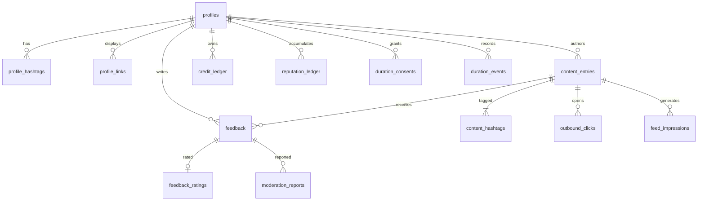

# Fydio Data Model & Schema Architecture

The PostgreSQL schema in `supabase/migrations/` is the authoritative enforcement layer for the Fydio product specification. Where the product brief states a rule — five profile hashtags, exactly three per entry, one Credit per submission, Reputation that cannot be spent, coarse-only duration bands — Postgres guarantees it with constraints, triggers, and RLS policies, proven by the pgTAP test suite.

---

## 1. The Central Separation: Two Distinct Ledgers

Fydio features two community signals that are mathematically and structurally isolated:

| Signal                  | Earned By                           | Primary Effect                   | Spendable? | Ledger Mechanics                                         |
| :---------------------- | :---------------------------------- | :------------------------------- | :--------- | :------------------------------------------------------- |
| **Fydio Credits**       | Eligible peer feedback on content   | Submitting entries to the feed   | **Yes**    | Status-driven (`held`, `available`, `spent`, `reversed`) |
| **Feedback Reputation** | Entry creators rating feedback 1–10 | Social trust & quality indicator | **No**     | Strictly append-only; corrections use reversing pairs    |

### Architectural Guardrails

- `credit_kind` and `reputation_kind` are separate Postgres enum types. SQL cannot write a credit into a reputation ledger or treat a reputation score as spendable balance.
- `credit_ledger` has a `status` column (`held` / `available` / `spent` / `reversed`). In contrast, `reputation_ledger` has **no status column** — it is strictly append-only.
- Content submission checks `credit_ledger` balance and nothing else. A member with 1,000 reputation and 0 Credits cannot submit.

### Balance Formula

```
balance = sum(delta) WHERE status IN ('available', 'spent')
```

- `held`: In review window; cannot be spent before it could be reversed.
- `available`: Spendable credit earned.
- `spent`: Negative delta (`-1`) recorded upon submission.
- `reversed`: Movement undone; excluded from balance sum.

---

## 2. Entity Relational Map



---

## 3. Core Tables

| Table                | Purpose                         | Key Constraints & Invariants                                                                                        |
| :------------------- | :------------------------------ | :------------------------------------------------------------------------------------------------------------------ |
| `profiles`           | Public member identity          | `id` references `auth.users(id)` ON DELETE CASCADE. Stores handle, display name, bio, avatar, and reputation cache. |
| `invites`            | Invite gate (T03, T11)          | Stores SHA-256 hashed invite tokens (`token_hash`). `claimed_by` references `profiles(id)`.                         |
| `hashtags`           | Global tag vocabulary           | Unique lowercase slugs (`citext`), stripped of leading `#`.                                                         |
| `profile_hashtags`   | Interest matching               | ≤ 5 hashtags per member profile enforced by constraint trigger.                                                     |
| `profile_links`      | Verified external handles       | Connected YouTube, Instagram, TikTok, X profile URLs.                                                               |
| `friendships`        | Mutual creator connections      | Canonical pair key `least(user_a, user_b) \|\| ':' \|\| greatest(...)` guarantees single row per mutual pair.       |
| `friend_requests`    | Directional friend invitations  | Unique per sender/receiver pair; prevents self-requests.                                                            |
| `content_entries`    | Shared creative posts           | Exactly 3 hashtags required; unique SHA-256 `url_hash` prevents duplicate submissions per creator.                  |
| `content_hashtags`   | Entry tags                      | Deferred constraint trigger enforces `count(*) = 3` per entry.                                                      |
| `feedback`           | Constructive peer feedback      | 40–4,000 chars, ≤ 3 image URLs. Requires entry to have been marked `opened` by the author.                          |
| `feedback_ratings`   | 1–10 creator evaluations        | Rated once per feedback item by the content author. Revisions generate ledger adjustment pairs.                     |
| `credit_ledger`      | Spendable Credits               | Transaction-scoped advisory locks prevent double-spend during concurrent submissions.                               |
| `reputation_ledger`  | Quality trust score             | Append-only ledger calculating cumulative creator reputation.                                                       |
| `outbound_clicks`    | Outbound platform visits        | Records link activation; mints signed 30-minute `return_token`.                                                     |
| `feed_impressions`   | Discovery audit & open tracking | Atomically tracks `opened = true` and rank scores.                                                                  |
| `feed_signals`       | Member feed tuning              | Positive ('more') / negative ('less') tuning signals; affects feed ranking only.                                    |
| `duration_consents`  | Telemetry opt-in audit          | Records explicit grant/revoke and `consent_version` (`2026-01-dur-v1`).                                             |
| `duration_events`    | Coarse active-tab duration      | **No duration_ms column exists**. Stores only coarse band enum (`lt_15s`, `s15_60`, `m1_3`, `gt_3`, `unknown`).     |
| `moderation_reports` | Community safety reports        | Deduped per reporter and target; routes to admin moderation queue.                                                  |
| `moderation_actions` | Immutable audit trail           | Append-only record of moderator interventions (hide, suspend, dismiss).                                             |

---

## 4. Key Stored Procedures

### `create_content_entry`

1. Validates exactly 3 distinct existing hashtags.
2. Verifies author is not suspended or rate-limited.
3. Acquires `pg_advisory_xact_lock(hashtext('credit:' || auth.uid()::text))` to serialize balance checks.
4. Confirms `get_credit_balance(auth.uid()) >= 1`.
5. Inserts entry, tags, and spends 1 Credit (`-1`, `spent`) atomically.

### `record_outbound_click`

1. Inserts audit row in `outbound_clicks`.
2. Upserts `feed_impressions` marking `opened = true` and `opened_at = now()`.
3. Mints a cryptographic 64-hex `return_token` valid for 30 minutes.

### `ingest_duration_event`

1. Executed exclusively by `service_role`.
2. Calls `has_current_duration_consent(p_user_id, current_version)` inside SQL.
3. Rejects with `42501` if active consent is missing or revoked.
4. Clamps band to enum; stores coarse band only.

### `get_migration_head`

Returns the highest applied version string from `supabase_migrations.schema_migrations` for continuous deploy health checks.

---

## 5. Security & Row Level Security (RLS)

RLS is enabled on **100% of tables**:

- `credit_ledger` and `duration_events` have `FORCE ROW LEVEL SECURITY`.
- `duration_events` is readable **only by the owning member**; cross-member queries return 0 rows.
- Private member information (credit balance, email, duration history) is completely shielded from public access.
